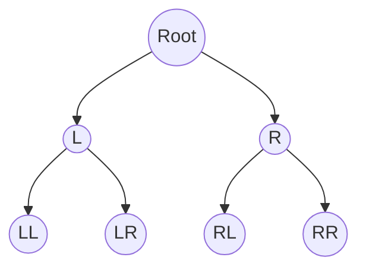

## Mathematical Details of the Models

#### Task Setup

Consider a 2-layer binary decision tree, the agent's goal is to maximize the reward overall

1. At stage 1: they can choose Left or Right
2. At stage 2: Given the branch of the first choice, choose Left or Right.

This yields 4 possible action sequences $\pi \in [LL, LR, RL, RR]$.

The agent can obtain the reward $R_i$ by visiting the node, the total path value is
$$
V_{\pi}=\sum_{i \in \text{nodes}(\pi)} \gamma^{d(i)-1}\,R_i
$$
Where $\gamma$ is a depth discount factor, $d(i)$ is the depth of the tree.

#### Observation Model(Perceptual level)

We assume that each node's reward should be estimated from noisy observation. Specifically, agent has a prior $p(r)$ for the reward node, which follows a standard normal distribution.
$$
r_i \sim \mathcal{N}(\mu_0, \sigma^2_0)
$$
At each time step $t$, the agent samples from reward node $r_i$ and receives a momentary noisy evidence:
$$
\delta x_t \mid r_i \sim \mathcal{N}(r_i, \sigma^2_x)
$$
Where the $\sigma_x^2$ is the observation noise for the agent. The cumulative evidence for reward node $i$ is simply the sum of all the momentary evidence:
$$
x(t) = \sum_{t=1}^N \delta x_t,\quad t = N\,\delta t.
$$
Based on the cumulative evidence, the agent try to infer the hidden value of the reward node based on bayesian rule:
$$
p(r_i \mid x(t))\propto p(x(t)\mid r_i)\,p(r_i).
$$
The analytical solution follows the form below:
$$
\sigma_{i}^2 = \left(\frac{1}{\sigma_0^2} + \frac{n_i}{\sigma_x^2}\right)^{-1} ,\qquad \mu_{i} = \sigma_{i}^2 \left(\frac{\mu_0}{\sigma_0^2} + \frac{x(t)}{\sigma_x^2}\right)
$$
Where $n_i$ is the numbers of time the node being observed. Therefore, the posterior of the reward node follows $\hat{r}_i \sim \mathcal{N}(\mu_i, \sigma_i^2)$

#### Decision Policy Update

Denote $\bold{\hat{r}}$ as the current observation for all reward nodes. Since the current estimate of each reward node contains uncertainty, we assume the agent trys to evaluate how likely each policy $\pi$ (i.e., action sequences) become the optimal policy that can maximize the reward, which can be written as $p(\pi = \pi^* \mid \bold{\hat{r}})$. This likelihood is typically intractable, we calculate using numerical method through Monte-Carlo sampling
$$
\hat{P}(\pi  = \pi^* \mid \bold{\hat{r}})
\approx
\frac{1}{S}\sum_{s=1}^S \mathbf{1}\left\{V_\pi^{(s)}>\max_{\pi’}V_{\pi’}^{(s)}\right\}
$$
This indicates that for each policy $\pi$, we draw $S$ samples and calculate what is the empirical frequency for this policy has the largest return over any other policy $\pi'$.

#### Node Sampling Strategy

At each sampling step, the agent must choose **which node** $i$ in the decision tree to observe next.

##### Goal-directed(policy) fixation

The **base distribution** $p_{\text{base}}(i)$ translates the policy posterior $\Pi$ into node-level sampling priorities.
$$
p_{\text{base}}(i) \propto \sum_{p \in \text{feasible}} \frac{\pi_p}{|N_{\pi_{p}}|}\; \mathbf{1}[i \in \pi_p]
$$
That is, each path’s posterior probability $\Pi_p$ is evenly distributed across the nodes that belong to that path.

##### Spatial proximity weighting

When the agent decides to *switch* to another node, proximity to the previous node matters.

Let $D(i,j)$ be the shortest path distance between nodes $i$ and $j$. Then define a **distance-based kernel**:
$$
k(i \mid \text{last}) \propto e^{-\lambda D(i,\text{last})}
$$

##### Overall Sampling Strategy

Overall, the **switching distribution** combines this spatial bias with the base distribution:
$$
p_{\text{switch}}(i) \propto p_{\text{base}}(i) \cdot k(i \mid \text{last})
$$
The final sampling distribution over nodes is a convex combination of staying and switching:
$$
p_{\text{final}} =
p_{\text{stay}} \cdot  \mathbf{1}[i = \text{last}] +
(1 - p_{\text{stay}}) \cdot p_{\text{base}}(i) \cdot k(i \mid \text{last}).
$$

#### Decision Threshold

The decision is made unitl the entropy of the policy likelihood is smaller than certain threshold for both stage 1 or stage 2
$$
H(Π) = -\sum_{\pi} Π(\pi)\log Π(\pi) \le H_{\text{thresh}}
$$

### Unused

----

$$
P(\pi \mid \bold{\hat{r}})
\propto
P(\bold{\hat{r}} \mid \pi)\,P(\pi)
$$
Where $P(\bold{\hat{r}} \mid \pi)$ is the 

Let $\pi$ denote a possible policy, corresponding to a complete sequence of fixations and final choice of node. Each policy yields a (random) reward $R_\pi$ determined by the latent variables $z_i$ associated with the visited nodes.

Given the current belief over all reward nodes $\{p(z_i \mid x_i(t))\}$, the agent’s belief about the reward of each policy is obtained by marginalizing over the latent rewards:
$$
p(R_\pi \mid \mathcal{D}t) = \int p(R_\pi \mid \mathbf{z})\, p(\mathbf{z} \mid \mathcal{D}t)\, d\mathbf{z},
$$
where $\mathcal{D}t = \{(i\tau, \delta x\tau)\}_{\tau=1}^{t}$ denotes all fixation–evidence pairs observed so far.

The posterior distribution over policies is then
$$
p(\pi \mid \mathcal{D}t) \propto p(\pi)\, p(R\pi \mid \mathcal{D}_t),
$$
where $p(\pi)$ is the policy prior (uniform at the beginning).

